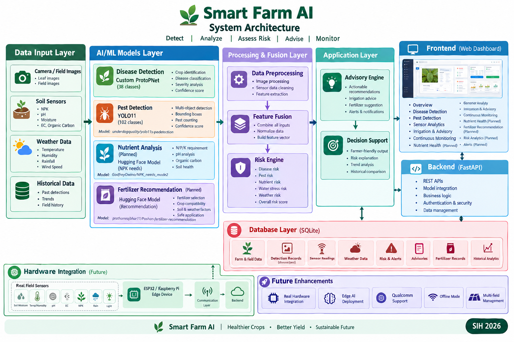

<div align="center">

# 🌱 Smart Farm AI

### AI-Powered Field-Deployable Smart Farming Assistant

**An intelligent agriculture platform for crop disease detection, pest detection, soil and nutrient analysis, risk assessment, irrigation support, and continuous field monitoring.**

<br>


<br>

**Observe → Detect → Analyze → Assess Risk → Advise → Monitor**

</div>

---

## 📑 Table of Contents

- [🚜 About the Project](#-about-the-project)
- [🎯 Problem Statement](#-problem-statement)
- [💡 Proposed Solution](#-proposed-solution)
- [✨ Features](#-features)
- [🏗️ System Architecture](#️-system-architecture)
- [🔄 End-to-End Workflow](#-end-to-end-workflow)
- [🤖 AI/ML Models](#-aiml-models)
- [🌿 Crop Disease Detection](#-crop-disease-detection-1)
- [🦠 Disease Classes](#-disease-classes)
- [🐛 Pest Detection](#-pest-detection-1)
- [🐜 Pest Classes](#-pest-classes)
- [🌱 Nutrient Intelligence](#-nutrient-intelligence)
- [🧪 Fertilizer Recommendation](#-fertilizer-recommendation)
- [🌦️ Environmental Monitoring](#️-environmental-monitoring)
- [🧠 Risk Assessment](#-risk-assessment)
- [💬 Advisory Engine](#-advisory-engine)
- [📡 Continuous Monitoring](#-continuous-monitoring-1)
- [🖥️ Dashboard](#️-dashboard)
- [📂 Project Structure](#-project-structure)
- [⚙️ Technology Stack](#️-technology-stack)
- [🗃️ Database Design](#️-database-design)
- [🔌 Future Hardware Integration](#-future-hardware-integration)
- [🧪 Testing](#-testing)
- [▶️ Installation](#️-installation)
- [🚀 Running the Project](#-running-the-project)
- [🔗 Planned API Endpoints](#-planned-api-endpoints)
- [🗺️ Development Roadmap](#️-development-roadmap)
- [⚠️ Current Limitations](#️-current-limitations)
- [🔐 Responsible AI & Agricultural Safety](#-responsible-ai--agricultural-safety)
- [🔮 Future Vision](#-future-vision)
- [📌 Project Status](#-project-status)
- [📚 AI Model References](#-ai-model-references)
- [📜 License](#-license)

---

# 🚜 About the Project

**Smart Farm AI** is an AI-powered smart farming assistant being developed for **Smart India Hackathon (SIH) 2026**.

The system is designed around the problem statement of building a:

> **Field-deployable AI-powered Smart Farming Assistant that helps farmers detect crop diseases, pests, nutrient deficiencies, and irrigation needs at an early stage, while improving resilience against droughts, floods, heat waves, and other agricultural risks common in India.**

The platform combines multiple sources of agricultural information into a single system:

- 📷 Crop images
- 🌿 Disease detection
- 🐛 Pest detection
- 🌱 Soil nutrient information
- 💧 Soil moisture
- 🌡️ Temperature
- 💦 Humidity
- 🌧️ Weather information
- 📈 Historical observations
- ⚠️ Risk indicators

The long-term objective is to move from **manual and reactive farming** toward **continuous AI-assisted field monitoring and early warning**.

---

# 🎯 Problem Statement

Farmers can face several challenges during crop production:

- Diseases may not be identified during their early stages.
- Pest populations can increase quickly.
- Nutrient deficiencies may remain unnoticed.
- Irrigation decisions may depend heavily on manual observation.
- Weather conditions can increase agricultural risks.
- Soil and crop information is often available in separate systems.
- Farmers may not have access to continuous field-level monitoring.

A useful smart farming system should not only detect a disease.

It should understand the **overall condition of the field**.

For example:

```text
Disease detected
       +
Pest population increasing
       +
Nitrogen decreasing
       +
Soil moisture decreasing
       +
High temperature
       ↓
Increasing agricultural risk
       ↓
Early warning + advisory
```

---

# 💡 Proposed Solution

Smart Farm AI follows a multi-layer architecture.

```text
                     FARM FIELD
                         │
          ┌──────────────┼──────────────┐
          │              │              │
          ▼              ▼              ▼
       CAMERA        SOIL SENSORS     WEATHER
          │              │              │
          ▼              ▼              ▼
     Disease AI      Soil/NPK AI    Weather Analysis
          │              │              │
          ▼              ▼              │
       Pest AI       Nutrient AI        │
          │              │              │
          └──────────────┼──────────────┘
                         ▼
                   FUSION ENGINE
                         │
                         ▼
                    RISK ENGINE
                         │
          ┌──────────────┼──────────────┐
          │              │              │
          ▼              ▼              ▼
      Disease Risk    Pest Risk    Nutrient/Water Risk
          │              │              │
          └──────────────┼──────────────┘
                         ▼
                  ADVISORY ENGINE
                         │
                         ▼
                 FARMER DASHBOARD
                         │
                         ▼
                   DATABASE
                         │
                         ▼
              HISTORICAL ANALYTICS
                         │
                         ▼
              CONTINUOUS MONITORING
```

---

# ✨ Features

## 🌿 Crop Disease Detection

The current system uses a custom-trained **ProtoPNet** model.

It supports:

* Leaf image upload
* Crop identification
* Disease classification
* Healthy crop classification
* Prediction confidence
* Disease severity
* Disease type
* Scientific disease information
* 38 total classes

---

## 🐛 Pest Detection

The pest detection system uses a YOLO11-based object detection model.

It supports:

* Multiple pest detection in a single image
* Bounding boxes
* Pest class identification
* Confidence score
* Pest counting
* Pest pressure estimation

Unlike a simple image classifier, the pest model can identify multiple individual pests within the same image.

---

## 📊 Sensor Analytics

The platform is designed to monitor environmental and soil conditions such as:

* Temperature
* Humidity
* Soil moisture
* pH
* EC
* NPK
* Organic carbon
* Other available nutrients

The current system supports mock/simulated sensor data while the hardware layer is being developed.

---

## 💧 Irrigation & Advisory

The irrigation and advisory system is designed to consider:

* Soil moisture
* Temperature
* Humidity
* Weather
* Crop condition
* Disease risk
* Pest pressure

The objective is to provide a more informed irrigation decision rather than relying only on a fixed timer.

---

## 📡 Continuous Monitoring

The final system is designed to repeatedly observe the field.

```text
Observe
   ↓
Detect
   ↓
Store
   ↓
Compare with History
   ↓
Calculate Trend
   ↓
Assess Risk
   ↓
Generate Alert
   ↓
Provide Advisory
   ↓
Monitor Again
```

---

# 🏗️ System Architecture

The complete system architecture is represented in the following diagram:



> **Note:** Place your architecture image at `docs/smart_farm_architecture.png`.

### Architecture Overview

```text
                          ┌───────────────────────┐
                          │       FARM FIELD      │
                          └───────────┬───────────┘
                                      │
               ┌──────────────────────┼──────────────────────┐
               │                      │                      │
               ▼                      ▼                      ▼
        ┌─────────────┐       ┌─────────────┐       ┌─────────────┐
        │   Camera    │       │ Soil Sensor │       │   Weather   │
        │    Input    │       │    Input    │       │    Input    │
        └──────┬──────┘       └──────┬──────┘       └──────┬──────┘
               │                     │                     │
               ▼                     ▼                     ▼
        ┌─────────────┐       ┌─────────────┐       ┌─────────────┐
        │   Disease   │       │  Nutrient   │       │ Environment │
        │  ProtoPNet  │       │   Engine    │       │   Engine    │
        └──────┬──────┘       └──────┬──────┘       └──────┬──────┘
               │                     │                     │
               ▼                     │                     │
        ┌─────────────┐              │                     │
        │    Pest     │              │                     │
        │   YOLO11    │              │                     │
        └──────┬──────┘              │                     │
               │                     │                     │
               └─────────────────────┼─────────────────────┘
                                     ▼
                              ┌──────────────┐
                              │    FUSION    │
                              │    ENGINE    │
                              └──────┬───────┘
                                     │
                                     ▼
                              ┌──────────────┐
                              │     RISK     │
                              │    ENGINE    │
                              └──────┬───────┘
                                     │
                                     ▼
                              ┌──────────────┐
                              │   ADVISORY   │
                              │    ENGINE    │
                              └──────┬───────┘
                                     │
                    ┌────────────────┼────────────────┐
                    │                │                │
                    ▼                ▼                ▼
               Dashboard          Alerts         Database
                    │                                 │
                    └────────────────┬────────────────┘
                                     ▼
                            Historical Analytics
                                     │
                                     ▼
                            Continuous Monitoring
```

---

# 🔄 End-to-End Workflow

The complete system is designed to follow this workflow:

### Step 1 — Observe

Collect:

* Camera image/frame
* Soil information
* Environmental information
* Weather information

### Step 2 — Detect

Run:

* Disease detection
* Pest detection

### Step 3 — Analyze

Analyze:

* Nutrient condition
* Soil moisture
* Environmental condition
* Pest pressure
* Disease severity

### Step 4 — Historical Comparison

Compare the current observation with previous observations.

Example:

```text
Previous Nitrogen = 45
Current Nitrogen  = 31

Trend = Decreasing
```

### Step 5 — Risk Assessment

Calculate:

* Disease risk
* Pest risk
* Nutrient risk
* Water stress
* Weather risk
* Overall agricultural risk

### Step 6 — Advisory

Generate farmer-friendly recommendations.

### Step 7 — Store

Save:

* Detection results
* Sensor readings
* Risk scores
* Alerts
* Recommendations

### Step 8 — Monitor Again

After the configured monitoring interval, the process repeats.

---

# 🤖 AI/ML Models

The project uses different models for different agricultural tasks rather than forcing one model to solve everything.

| Module                    | Model                                               | Purpose                                | Status            |
| ------------------------- | --------------------------------------------------- | -------------------------------------- | ----------------- |
| Disease Detection         | Custom ProtoPNet                                    | Detect crop diseases and healthy crops | 🟢 Implemented    |
| Pest Detection            | `underdogquality/yolo11s-pest-detection`            | Detect agricultural pests              | 🟢 Integrated     |
| NPK Requirement           | `GodfreyOwino/NPK_needs_mode2`                      | Estimate nutrient requirements         | 🟡 Planned        |
| Fertilizer Recommendation | `prathamrajbhar11/Poshan-fertilizer-recommendation` | Support fertilizer recommendation      | 🟡 Planned        |
| Risk Engine               | Rule/score-based engine                             | Combine agricultural risks             | 🟡 In Development |
| Advisory Engine           | Structured decision layer                           | Generate actionable advisories         | 🟡 In Development |

---

# 🌿 Crop Disease Detection

The disease detection system uses a custom **ProtoPNet** model.

### Model Architecture

The deployment model is based on:

* ConvNeXt-Tiny backbone
* Prototype-based learning
* 190 prototypes
* 38 output classes
* 256-dimensional prototype representation
* Cosine similarity
* PyTorch inference
* ImageNet normalization
* Input size: `224 × 224`

The model can distinguish between diseased and healthy crops.

### Example Output

```json
{
  "crop": "Tomato",
  "disease": "Early_blight(Tomato)",
  "confidence": 0.93,
  "severity": "Moderate"
}
```

---

# 🦠 Disease Classes

The current disease model supports **38 classes**.

## Disease Classes — 25

| ID | Class                                 | Crop       | Causal Type | Scientific Name                          | Severity |
| -: | ------------------------------------- | ---------- | ----------- | ---------------------------------------- | -------- |
|  0 | Apple_scab(Apple)                     | Apple      | Fungal      | *Venturia inaequalis*                    | Moderate |
|  1 | Bacterial_spot(Peach)                 | Peach      | Bacterial   | *Xanthomonas arboricola pv. pruni*       | High     |
|  2 | Bacterial_spot(Pepper)                | Pepper     | Bacterial   | *Xanthomonas campestris pv. vesicatoria* | High     |
|  3 | Bacterial_spot(Tomato)                | Tomato     | Bacterial   | *Xanthomonas vesicatoria*                | High     |
|  4 | Black_rot(Apple)                      | Apple      | Fungal      | *Botryosphaeria obtusa*                  | High     |
|  5 | Black_rot(Grape)                      | Grape      | Fungal      | *Guignardia bidwellii*                   | High     |
|  6 | Cedar_apple_rust(Apple)               | Apple      | Fungal      | *Gymnosporangium juniperi-virginianae*   | Moderate |
|  7 | Cercospora_leaf_spot(Corn)            | Corn       | Fungal      | *Cercospora zeae-maydis*                 | Moderate |
|  8 | Common_rust(Corn)                     | Corn       | Fungal      | *Puccinia sorghi*                        | Moderate |
|  9 | Early_blight(Potato)                  | Potato     | Fungal      | *Alternaria solani*                      | Moderate |
| 10 | Early_blight(Tomato)                  | Tomato     | Fungal      | *Alternaria solani*                      | Moderate |
| 11 | Esca(Grape)                           | Grape      | Fungal      | *Phaeomoniella chlamydospora*            | High     |
| 12 | Haunglongbing(Orange)                 | Orange     | Bacterial   | *Candidatus Liberibacter asiaticus*      | Critical |
| 13 | Late_blight(Potato)                   | Potato     | Oomycete    | *Phytophthora infestans*                 | Critical |
| 14 | Late_blight(Tomato)                   | Tomato     | Oomycete    | *Phytophthora infestans*                 | Critical |
| 15 | Leaf_Mold(Tomato)                     | Tomato     | Fungal      | *Passalora fulva*                        | Moderate |
| 16 | Leaf_blight(Grape)                    | Grape      | Fungal      | *Pseudocercospora vitis*                 | Moderate |
| 17 | Leaf_scorch(Strawberry)               | Strawberry | Fungal      | *Diplocarpon earliana*                   | High     |
| 18 | Northern_Leaf_Blight(Corn)            | Corn       | Fungal      | *Exserohilum turcicum*                   | High     |
| 19 | Powdery_mildew(Cherry)                | Cherry     | Fungal      | *Podosphaera clandestina*                | Moderate |
| 20 | Septoria_leaf_spot(Tomato)            | Tomato     | Fungal      | *Septoria lycopersici*                   | High     |
| 21 | Spider_mites(Tomato)                  | Tomato     | Pest        | *Tetranychus urticae*                    | Moderate |
| 22 | Target_Spot(Tomato)                   | Tomato     | Fungal      | *Corynespora cassiicola*                 | High     |
| 23 | Tomato_Yellow_Leaf_Curl_Virus(Tomato) | Tomato     | Viral       | TYLCV                                    | Critical |
| 24 | Tomato_mosaic_virus(Tomato)           | Tomato     | Viral       | ToMV                                     | High     |

---

## 🌱 Healthy Crop Classes — 13

| ID | Class              |
| -: | ------------------ |
| 25 | Healthy Apple      |
| 26 | Healthy Blueberry  |
| 27 | Healthy Cherry     |
| 28 | Healthy Corn       |
| 29 | Healthy Grape      |
| 30 | Healthy Orange     |
| 31 | Healthy Peach      |
| 32 | Healthy Pepper     |
| 33 | Healthy Potato     |
| 34 | Healthy Raspberry  |
| 35 | Healthy Soybean    |
| 36 | Healthy Strawberry |
| 37 | Healthy Tomato     |

### Disease Metadata

The disease system stores additional metadata for each class:

* Crop
* Disease
* Healthy/Diseased status
* Causal type
* Scientific name
* Severity

This information can later be used by the risk and advisory engines.

---

# 🐛 Pest Detection

The pest detection module uses the Hugging Face model:

**`underdogquality/yolo11s-pest-detection`**

### Model

**YOLO11 Small**

### Dataset

**IP102**

### Supported Classes

**102 agricultural pest classes**

The model performs object detection rather than simple image classification.

Therefore one image can contain multiple pest detections.

### Example

```text
Input Field Image
       │
       ▼
     YOLO11
       │
       ├── Aphid       0.91
       ├── Aphid       0.87
       ├── Whitefly    0.83
       └── Thrips      0.76
       │
       ▼
Pest Count + Bounding Boxes
```

### Example API Result

```json
{
  "pests": [
    {
      "name": "aphids",
      "confidence": 0.91,
      "bbox": [120, 80, 180, 140]
    },
    {
      "name": "aphids",
      "confidence": 0.87,
      "bbox": [300, 150, 350, 210]
    }
  ],
  "total_pests": 2,
  "pest_counts": {
    "aphids": 2
  }
}
```

The model card reports approximately:

* Precision: `0.744`
* Recall: `0.789`
* mAP@0.5: `0.815`
* mAP@0.5:0.95: `0.605`

These are reported benchmark values from the model source and should not be treated as guaranteed performance under all Indian field conditions.

---

# 🐜 Pest Classes

The selected YOLO11 pest model supports the following 102 classes:

```text
1.  rice leaf roller
2.  rice leaf caterpillar
3.  paddy stem maggot
4.  asiatic rice borer
5.  yellow rice borer
6.  rice gall midge
7.  Rice Stemfly
8.  brown plant hopper
9.  white backed plant hopper
10. small brown plant hopper
11. rice water weevil
12. rice leafhopper
13. grain spreader thrips
14. rice shell pest
15. grub
16. mole cricket
17. wireworm
18. white margined moth
19. black cutworm
20. large cutworm
21. yellow cutworm
22. red spider
23. corn borer
24. army worm
25. aphids
26. Potosiabre vitarsis
27. peach borer
28. english grain aphid
29. green bug
30. bird cherry-oataphid
31. wheat blossom midge
32. penthaleus major
33. wheat phloeothrips
34. wheat sawfly
35. cerodonta denticornis
36. beet fly
37. flea beetle
38. cabbage army worm
39. beet army worm
40. Beet spot flies
41. meadow moth
42. beet weevil
43. sericaorient alismots chulsky
44. alfalfa weevil
45. flax budworm
46. alfalfa plant bug
47. tarnished plant bug
48. Locustoidea
49. lytta polita
50. legume blister beetle
51. blister beetle
52. therioaphis maculata Buckton
53. odontothrips loti
54. Thrips
55. alfalfa seed chalcid
56. Pieris canidia
57. Apolygus lucorum
58. Limacodidae
59. Viteus vitifoliae
60. Colomerus vitis
61. Brevipoalpus lewisi McGregor
62. oides decempunctata
63. Polyphagotars onemus latus
64. Pseudococcus comstocki Kuwana
65. parathrene regalis
66. Ampelophaga
67. Lycorma delicatula
68. Xylotrechus
69. Cicadella viridis
70. Miridae
71. Trialeurodes vaporariorum
72. Erythroneura apicalis
73. Papilio xuthus
74. Panonchus citri McGregor
75. Phyllocoptes oleiverus ashmead
76. Icerya purchasi Maskell
77. Unaspis yanonensis
78. Ceroplastes rubens
79. Chrysomphalus aonidum
80. Parlatoria zizyphus Lucus
81. Nipaecoccus vastalor
82. Aleurocanthus spiniferus
83. Tetradacus c Bactrocera minax
84. Dacus dorsalis(Hendel)
85. Bactrocera tsuneonis
86. Prodenia litura
87. Adristyrannus
88. Phyllocnistis citrella Stainton
89. Toxoptera citricidus
90. Toxoptera aurantii
91. Aphis citricola Vander Goot
92. Scirtothrips dorsalis Hood
93. Dasineura sp
94. Lawana imitata Melichar
95. Salurnis marginella Guerr
96. Deporaus marginatus Pascoe
97. Chlumetia transversa
98. Mango flat beak leafhopper
99. Rhytidodera bowrinii white
100. Sternochetus frigidus
101. Cicadellidae
102. Additional model mapping / class entry as provided by the model configuration
```

> **Implementation note:** The exact class names should always be loaded from the model's `pests.yaml` / class configuration rather than manually hard-coded in the application.

---

# 🌱 Nutrient Intelligence

Nutrient analysis is a major planned component of the system.

The goal is to identify potential nutrient deficiencies using:

```text
Soil Data
   +
Crop
   +
Growth Stage
   +
Historical Data
   +
Weather
   ↓
Nutrient Status Engine
   ↓
NPK Requirement Estimation
   ↓
Fertilizer Matching
   ↓
Weather Safety Check
   ↓
Farmer Advisory
```

### Planned Nutrient Inputs

* Nitrogen (N)
* Phosphorus (P)
* Potassium (K)
* pH
* Soil moisture
* Organic carbon
* Organic matter
* EC

Optional micronutrients:

* Sulfur
* Zinc
* Iron
* Boron
* Manganese
* Copper

---

# 🧪 Fertilizer Recommendation

The fertilizer module will combine nutrient requirements with a fertilizer catalog.

### Primary NPK Model

**`GodfreyOwino/NPK_needs_mode2`**

The model is intended to estimate nutrient requirements using information such as:

* Crop
* Target yield
* Field size
* pH
* Organic carbon
* Nitrogen
* Phosphorus
* Potassium
* Soil moisture

Expected outputs include:

* Nitrogen requirement
* Phosphorus requirement
* Potassium requirement
* Organic matter requirement
* Lime requirement

### Secondary Fertilizer Model

**`prathamrajbhar11/Poshan-fertilizer-recommendation`**

This model is being evaluated as a second-stage fertilizer recommendation component.

The final architecture will be:

```text
Soil NPK
   +
Crop
   +
Growth Stage
   +
pH
   +
Weather
   ↓
Nutrient Status
   ↓
NPK Needs Model
   ↓
Fertilizer Matching
   ↓
Fertilizer Recommendation Model
   ↓
Weather Safety Check
   ↓
Final Recommendation
```

### Important

The system will distinguish between:

1. Nutrient deficiency detection
2. Estimated nutrient requirement
3. Fertilizer selection
4. Exact application dosage

Exact agricultural application rates require validated crop-, soil-, region-, and agronomy-specific information.

The prototype should therefore be treated as a **decision-support system**, not an autonomous prescription system.

---

# 🌦️ Environmental Monitoring

Environmental conditions are important because the same disease, pest, or nutrient condition can have different risks under different environmental conditions.

The platform is designed to monitor:

| Parameter      | Purpose                      |
| -------------- | ---------------------------- |
| Temperature    | Heat-stress analysis         |
| Humidity       | Disease/pest context         |
| Soil Moisture  | Irrigation and water stress  |
| Rainfall       | Irrigation/fertilizer timing |
| Wind Speed     | Weather/application context  |
| pH             | Nutrient availability        |
| EC             | Soil condition               |
| Organic Carbon | Soil health                  |
| N/P/K          | Nutrient status              |

---

# 🧠 Risk Assessment

The risk engine will combine multiple agricultural signals.

Example:

```text
Disease:
Early Blight
Severity:
Moderate

Pest:
Aphids
Pressure:
High

Nitrogen:
Low

Potassium:
Low

Soil Moisture:
Low

Temperature:
High
```

The risk engine can produce:

```text
Disease Risk      → MODERATE
Pest Risk         → HIGH
Nutrient Risk     → MODERATE
Water Stress      → HIGH
Weather Risk      → MODERATE

Overall Risk      → HIGH
```

The risk engine is intended to be configurable rather than based on a single fixed universal threshold.

---

# 💬 Advisory Engine

The advisory engine converts structured agricultural observations into farmer-friendly information.

Example:

```text
Priority: HIGH

Observations:

• Disease detected
• Pest pressure is increasing
• Nitrogen is low
• Soil moisture is low
• High temperature detected

Suggested actions:

1. Inspect affected plants.
2. Check irrigation requirement.
3. Review nutrient recommendation.
4. Continue pest monitoring.
5. Monitor the field again after the configured interval.
```

The advisory layer should not invent numerical agricultural measurements.

It should use the structured output produced by the detection, sensor, risk, and recommendation systems.

---

# 📡 Continuous Monitoring

Continuous monitoring is one of the main long-term goals of the project.

A one-time system works like:

```text
Image
  ↓
Prediction
  ↓
Done
```

Smart Farm AI is designed to work like:

```text
Observation 1
      ↓
Observation 2
      ↓
Observation 3
      ↓
Observation 4
      ↓
Historical Analysis
      ↓
Trend Detection
      ↓
Risk Assessment
      ↓
Alert
```

### Example — Nutrient Trend

```text
Day 1      N = 45
Day 7      N = 38
Day 14     N = 31
```

The system detects:

```text
Nitrogen Trend = DECREASING
```

### Example — Pest Trend

```text
Day 1      3 pests
Day 7      6 pests
Day 14     12 pests
```

The system detects:

```text
Pest Pressure = INCREASING
```

### Example — Disease Confidence

```text
Observation 1 → 0.32
Observation 2 → 0.51
Observation 3 → 0.71
Observation 4 → 0.86
```

This can indicate an increasing disease signal that deserves attention.

---

# 🖥️ Dashboard

The dashboard is designed as a centralized Smart Farm control panel.

## Current Navigation

```text
Smart Farm
│
├── Overview
├── Disease Detection
├── Pest Detection
├── Sensor Analytics
├── Irrigation & Advisory
└── Continuous Monitoring
```

## Planned Extensions

```text
Smart Farm
│
├── Overview
├── Disease Detection
├── Pest Detection
├── Sensor Analytics
├── Nutrient Health
├── Fertilizer Recommendation
├── Irrigation & Advisory
├── Continuous Monitoring
├── Risk Analytics
├── Alerts
└── Field Management
```

---

# 📂 Project Structure

The final software architecture is being organized into independent modules.

```text
smart-farm-ai/
│
├── backend/
│   │
│   ├── main.py
│   ├── config.py
│   │
│   ├── api/
│   │   ├── routes_health.py
│   │   ├── routes_detection.py
│   │   ├── routes_monitoring.py
│   │   ├── routes_advisory.py
│   │   ├── routes_sensors.py
│   │   └── routes_fertilizer.py
│   │
│   ├── models/
│   │   ├── disease_model.py
│   │   ├── pest_model.py
│   │   ├── npk_needs_model.py
│   │   └── fertilizer_model.py
│   │
│   ├── services/
│   │   ├── disease_service.py
│   │   ├── pest_service.py
│   │   ├── nutrient_service.py
│   │   ├── fertilizer_service.py
│   │   ├── fusion_service.py
│   │   ├── risk_service.py
│   │   ├── advisory_service.py
│   │   └── monitoring_service.py
│   │
│   ├── sensors/
│   │   ├── base_sensor.py
│   │   ├── mock_sensor.py
│   │   ├── nutrient_sensor.py
│   │   └── sensor_manager.py
│   │
│   ├── database/
│   │   ├── database.py
│   │   ├── models.py
│   │   └── repository.py
│   │
│   └── schemas/
│       ├── detection.py
│       ├── sensor.py
│       ├── nutrient.py
│       ├── risk.py
│       └── advisory.py
│
├── frontend/
│   │
│   ├── pages/
│   │   ├── Overview
│   │   ├── DiseaseDetection
│   │   ├── PestDetection
│   │   ├── SensorAnalytics
│   │   ├── IrrigationAdvisory
│   │   ├── ContinuousMonitoring
│   │   ├── NutrientHealth
│   │   └── FertilizerRecommendation
│   │
│   ├── components/
│   └── services/
│
├── models/
│   ├── disease/
│   ├── pest/
│   ├── npk/
│   └── fertilizer/
│
├── data/
│   ├── fertilizer_catalog/
│   └── sample_sensor_data/
│
├── docs/
│   └── smart_farm_architecture.png
│
├── tests/
│
├── requirements.txt
├── .env.example
└── README.md
```

> The structure represents the target architecture. Existing working files should be preserved rather than unnecessarily rewritten.

---

# ⚙️ Technology Stack

| Category             | Technology                                  |
| -------------------- | ------------------------------------------- |
| Programming Language | Python                                      |
| Deep Learning        | PyTorch                                     |
| Disease Detection    | Custom ProtoPNet                            |
| Pest Detection       | YOLO11                                      |
| Computer Vision      | OpenCV                                      |
| Machine Learning     | Scikit-learn                                |
| Model Hub            | Hugging Face                                |
| NPK Intelligence     | Hugging Face NPK model                      |
| Backend              | FastAPI                                     |
| Frontend             | React                                       |
| Database             | SQLite                                      |
| GPU Acceleration     | NVIDIA CUDA                                 |
| Version Control      | Git / GitHub                                |
| Future Edge Hardware | Raspberry Pi / Qualcomm-compatible hardware |

---

# 🗃️ Database Design

The database is designed to store historical observations.

Planned entities include:

```text
Farm
│
├── Field
│
├── Crop
│
├── Detection Events
│   ├── Disease Detection
│   └── Pest Detection
│
├── Sensor Readings
│   ├── Temperature
│   ├── Humidity
│   ├── Soil Moisture
│   ├── pH
│   ├── EC
│   └── NPK
│
├── Weather Readings
│
├── Risk Events
│
├── Alerts
│
├── Advisories
│
├── Fertilizers
│
└── Fertilizer Recommendations
```

Historical data enables:

* Trend analysis
* Field history
* Disease progression
* Pest progression
* Nutrient trends
* Soil moisture trends
* Risk history
* Recommendation history

---

# 🔌 Future Hardware Integration

The current implementation is intentionally **hardware-independent**.

### Current prototype

```text
Mock Sensor
     ↓
Sensor Interface
     ↓
Backend
     ↓
Dashboard
```

### Future implementation

```text
Real Sensors
     ↓
ESP32 / Raspberry Pi / Edge Device
     ↓
Communication Layer
     ↓
Smart Farm Backend
     ↓
AI + Risk Engine
     ↓
Dashboard
```

### Possible Sensors

* Soil moisture sensor
* Temperature sensor
* Humidity sensor
* pH sensor
* EC sensor
* NPK sensor
* Rain sensor
* Light sensor
* Camera
* Weather station

The software will use provider interfaces so real hardware can be added without redesigning the entire system.

---

# 🧪 Testing

The project will include testing at multiple levels.

## Model Testing

* Disease model loading
* Disease prediction
* Confidence validation
* Pest detection
* Bounding box validation
* Multi-object detection

## API Testing

* Health endpoint
* Disease detection endpoint
* Pest detection endpoint
* Sensor endpoints
* Nutrient endpoints
* Fertilizer endpoints
* Monitoring endpoints

## Database Testing

* Sensor storage
* Detection storage
* Historical queries
* Risk storage
* Advisory storage

## Integration Testing

The complete pipeline will be tested as:

```text
Image / Sensor Data
       ↓
AI Models
       ↓
Fusion Engine
       ↓
Risk Engine
       ↓
Advisory Engine
       ↓
Database
       ↓
Dashboard
```

---

# ▶️ Installation

## 1. Clone the Repository

```bash
git clone <YOUR_GITHUB_REPOSITORY_URL>
cd smart-farm-ai
```

---

## 2. Create Virtual Environment

### Windows

```powershell
python -m venv venv
.\venv\Scripts\activate
```

### Linux / macOS

```bash
python3 -m venv venv
source venv/bin/activate
```

---

## 3. Install Dependencies

```bash
pip install -r requirements.txt
```

---

# 🚀 Running the Project

## Start Backend

```bash
uvicorn backend.main:app --reload
```

## Start Frontend

```bash
npm install
npm run dev
```

Typical local endpoints:

| Service           | URL                          |
| ----------------- | ---------------------------- |
| Frontend          | `http://localhost:5173`      |
| Backend           | `http://localhost:8000`      |
| API Documentation | `http://localhost:8000/docs` |

> Use the actual ports configured in the repository if they differ.

---

# 🔗 Planned API Endpoints

| Method | Endpoint                    | Purpose                            |
| ------ | --------------------------- | ---------------------------------- |
| `GET`  | `/api/health`               | System health                      |
| `POST` | `/api/disease/detect`       | Disease detection                  |
| `POST` | `/api/pests/detect`         | Pest detection                     |
| `POST` | `/api/detect/image`         | Combined image analysis            |
| `GET`  | `/api/sensors/latest`       | Latest sensor values               |
| `GET`  | `/api/sensors/history`      | Historical sensor data             |
| `GET`  | `/api/nutrients/latest`     | Latest nutrient status             |
| `POST` | `/api/nutrients/analyze`    | Analyze nutrient condition         |
| `POST` | `/api/fertilizer/recommend` | Generate fertilizer recommendation |
| `GET`  | `/api/fertilizer/catalog`   | Fertilizer catalog                 |
| `GET`  | `/api/monitoring/latest`    | Latest monitoring observation      |
| `GET`  | `/api/monitoring/history`   | Historical monitoring data         |
| `GET`  | `/api/risk/current`         | Current agricultural risk          |
| `GET`  | `/api/advisories`           | Farmer advisories                  |
| `GET`  | `/api/alerts`               | Active alerts                      |
| `GET`  | `/api/models/status`        | AI model status                    |

---

# 🗺️ Development Roadmap

## Phase 1 — Core AI Foundation

* [x] Smart Farm dashboard
* [x] Disease Detection page
* [x] Custom ProtoPNet model
* [x] 38 disease/healthy classes
* [x] Disease metadata
* [x] Pest Detection page
* [x] YOLO11 pest detection model
* [x] Multi-object pest detection
* [x] Sensor Analytics page
* [x] Irrigation & Advisory page
* [x] Continuous Monitoring page

---

## Phase 2 — Nutrient Intelligence

* [ ] Nutrient Health page
* [ ] Mock NPK sensor
* [ ] Nitrogen analysis
* [ ] Phosphorus analysis
* [ ] Potassium analysis
* [ ] pH analysis
* [ ] Organic carbon support
* [ ] Nutrient trend analysis
* [ ] Integrate `GodfreyOwino/NPK_needs_mode2`

---

## Phase 3 — Fertilizer Intelligence

* [ ] Fertilizer catalog
* [ ] Fertilizer matching engine
* [ ] Crop compatibility
* [ ] Soil compatibility
* [ ] Growth-stage consideration
* [ ] Weather-aware recommendation
* [ ] Integrate/evaluate `prathamrajbhar11/Poshan-fertilizer-recommendation`
* [ ] Fertilizer recommendation history

---

## Phase 4 — Risk Intelligence

* [ ] Disease risk scoring
* [ ] Pest pressure scoring
* [ ] Nutrient risk scoring
* [ ] Water-stress scoring
* [ ] Weather risk
* [ ] Combined agricultural risk
* [ ] Alert generation
* [ ] Risk history

---

## Phase 5 — Continuous Monitoring

* [ ] Scheduled observations
* [ ] Historical comparison
* [ ] Disease trend detection
* [ ] Pest trend detection
* [ ] Nutrient trend detection
* [ ] Soil moisture trend
* [ ] Environmental trend detection
* [ ] Automatic alerts
* [ ] Long-term field analytics

---

## Phase 6 — Real Hardware

* [ ] ESP32 integration
* [ ] Raspberry Pi integration
* [ ] Real soil moisture sensor
* [ ] Real temperature/humidity sensors
* [ ] Real pH sensor
* [ ] Real NPK sensor
* [ ] Field camera
* [ ] Weather station
* [ ] Offline data buffering

---

## Phase 7 — Edge AI

* [ ] Model optimization
* [ ] ONNX conversion where applicable
* [ ] TensorRT optimization where applicable
* [ ] Edge inference
* [ ] Qualcomm-compatible deployment exploration
* [ ] Low-power inference
* [ ] Offline-first operation
* [ ] Cloud synchronization

---

# ⚠️ Current Limitations

Smart Farm AI is currently a research and prototype system.

## Disease Detection

Performance can vary because of:

* Lighting conditions
* Image quality
* Camera distance
* Leaf orientation
* Background
* Disease stage

## Pest Detection

The selected pest model is based on the IP102 dataset and may not cover every pest species or field condition found in India.

## Nutrient Analysis

Nutrient thresholds depend on:

* Crop
* Growth stage
* Soil type
* Soil testing method
* Geographic region
* Local agronomic practices

Universal thresholds should therefore not be assumed.

## Fertilizer Recommendation

Model-generated recommendations require validation against local agronomic knowledge and field conditions before real-world deployment.

## Hardware

Real field hardware is part of the future implementation. The current system can use simulated/mock sensor data.

---

# 🔐 Responsible AI & Agricultural Safety

The system is designed as a **decision-support tool**.

It should not be considered a replacement for:

* Professional agronomists
* Soil testing laboratories
* Agricultural extension services
* Local farming guidelines

AI predictions should be combined with field observations and validated agricultural information.

The system should avoid presenting uncertain predictions as absolute facts.

---

# 🔮 Future Vision

The long-term goal is to create an intelligent field-level agricultural assistant.

```text
                         SMART FARM AI
                              │
        ┌─────────────────────┼─────────────────────┐
        │                     │                     │
      CAMERA                SENSORS              WEATHER
        │                     │                     │
        ▼                     ▼                     ▼
   DISEASE AI             SOIL/NPK AI        ENVIRONMENT AI
        │                     │                     │
        └─────────────────────┼─────────────────────┘
                              ▼
                       FUSION ENGINE
                              │
                              ▼
                         RISK ENGINE
                              │
              ┌───────────────┼───────────────┐
              │               │               │
           DISEASE           PEST          NUTRIENT
              │               │               │
              └───────────────┼───────────────┘
                              ▼
                       ADVISORY ENGINE
                              │
                              ▼
                       FARMER DASHBOARD
                              │
                              ▼
                       HISTORICAL DATA
                              │
                              ▼
                    CONTINUOUS MONITORING
                              │
                              ▼
                         EARLY WARNING
```

The final objective is to move beyond:

> **"What disease does this leaf have?"**

towards:

> **"What is happening in my field, what risks are increasing, why are they increasing, and what should I check or do next?"**

---

# 📌 Project Status

| Component                    | Status                      |
| ---------------------------- | --------------------------- |
| Smart Farm Dashboard         | 🟢 Active                   |
| Disease Detection UI         | 🟢 Implemented              |
| Custom ProtoPNet             | 🟢 Implemented              |
| 38 Disease/Healthy Classes   | 🟢 Implemented              |
| Disease Metadata             | 🟢 Implemented              |
| Pest Detection               | 🟢 Implemented / Integrated |
| 102 Pest Classes             | 🟢 Supported                |
| Sensor Analytics             | 🟡 Prototype                |
| Irrigation & Advisory        | 🟡 Prototype                |
| Continuous Monitoring        | 🟡 Prototype / Architecture |
| Nutrient Health              | 🟡 In Development           |
| NPK Requirement Model        | 🟡 Planned                  |
| Fertilizer Recommendation    | 🟡 Planned                  |
| Risk Fusion                  | 🟡 In Development           |
| Real Sensors                 | 🔵 Future                   |
| Edge AI                      | 🔵 Future                   |
| Qualcomm Hardware Deployment | 🔵 Future                   |

---

# 📚 AI Model References

### Disease Detection

Custom-trained ProtoPNet model developed as part of this project.

### Pest Detection

Hugging Face:

`underdogquality/yolo11s-pest-detection`

### NPK Requirement Estimation

Hugging Face:

`GodfreyOwino/NPK_needs_mode2`

### Fertilizer Recommendation

Hugging Face:

`prathamrajbhar11/Poshan-fertilizer-recommendation`

Third-party models remain subject to their respective licenses and terms.

---

# 📜 License

This project is developed for **Smart India Hackathon 2026**, research, educational, and prototype purposes.

Third-party datasets, pretrained models, libraries, and other components remain subject to their respective licenses.

---

<div align="center">

# 🌱 Smart Farm AI

### Observe the field. Understand the risk. Act early.

**Smart India Hackathon 2026**

<br>

⭐ Built for intelligent, resilient and data-driven agriculture.

</div>
